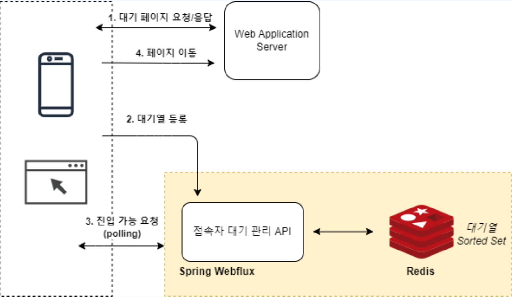
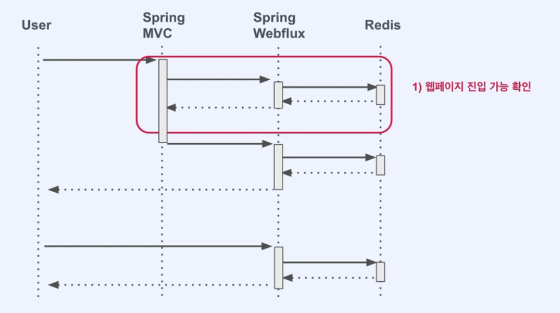
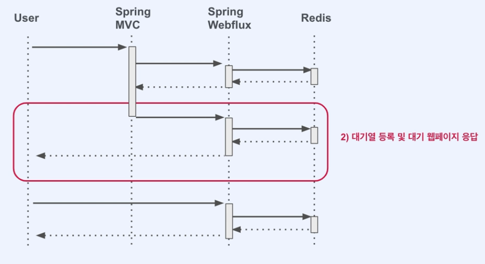
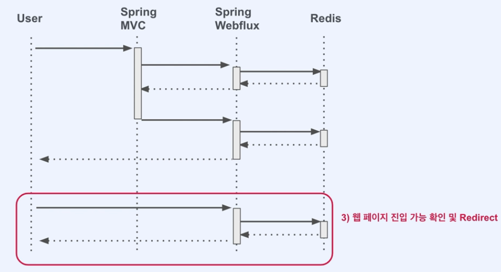

# User Queue System

## 프로젝트 개요
접속자에 대한 대기열을 만들어 유동적으로 트래픽을 조절 해보자

## 기술 스택
- **JDK**: OpenJDK 17
- **Framework**: Spring Boot 3.0.9, Spring Web Flux
- **Caching**: Redis

## 아키텍처

## 시퀀스 다이어그램

### 초기 웹페이지 진입 단계

### 대기열 등록

### 웹페이지 진입 및 리다이렉트

